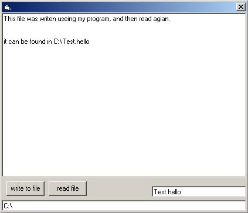



## \_\_\_\_A simple filereader & writer\_\_\_\_

### Description

This is a simple file reader\writer, it demonstrates how to use a filesystemobject and a textstream to write text to any file and to read text from any file.
 
### More Info
 

             |
---                |---
**Submitted On**   |2002-09-06 20:49:48
**By**             |[BelgiumBoy\_007](https://github.com/Planet-Source-Code/PSCIndex/blob/master/ByAuthor/belgiumboy-007.md)
**Level**          |Beginner
**User Rating**    |4.4 (92 globes from 21 users)
**Compatibility**  |VB 6\.0
**Category**       |[Files/ File Controls/ Input/ Output](https://github.com/Planet-Source-Code/PSCIndex/blob/master/ByCategory/files-file-controls-input-output__1-3.md)
**World**          |[Visual Basic](https://github.com/Planet-Source-Code/PSCIndex/blob/master/ByWorld/visual-basic.md)
**Archive File**   |[A\_simple\_f1296669112002\.zip](https://github.com/Planet-Source-Code/belgiumboy-007-a-simple-filereader-writer__1-38873/archive/master.zip)

